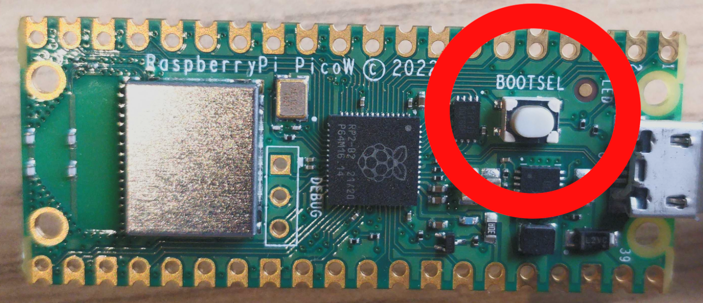
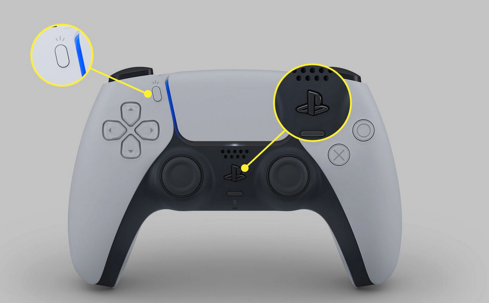
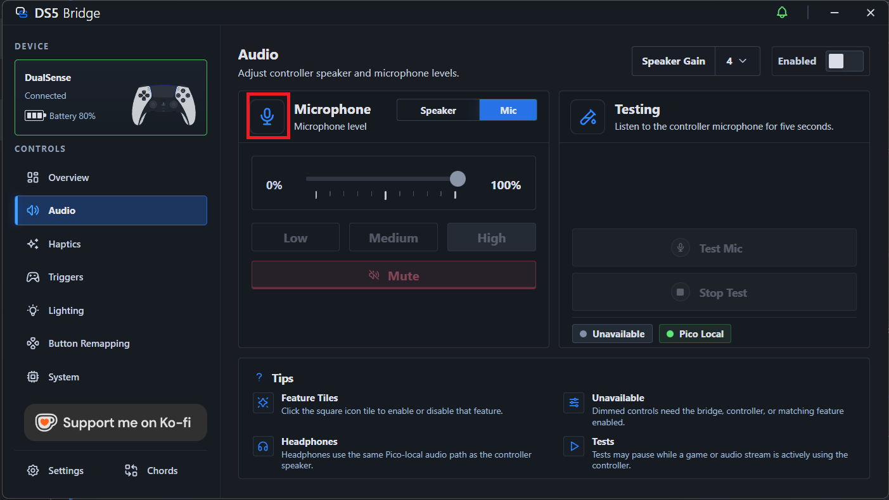

# Common issues
- [My pico 2 W storage isn't showing up.](#my-pico-2-w-storage-isnt-showing-up)

- [My dual sense controller isn't connecting.](#my-dual-sense-controller-isnt-connecting)

- [The microphone in the companion app is dimmed and I can't control it.](#the-microphone-in-the-companion-app-is-dimmed-and-i-cant-control-it)

- [Haptic feedback is working in the companion app, but not in games.](#haptic-feedback-is-working-in-the-companion-app-but-not-in-games)

- [My controller is turning off after few seconds and the pico's light flicker then turn off.](#my-controller-is-turning-off-after-few-seconds-and-the-picos-light-flicker-then-turn-off)

if you can't find your issue here, please open an issue in the GitHub repo or ask in the discord server.

### My pico 2 W storage isn't showing up

- Hold the white BOOTSEL button **BEFORE** plugging the Pico 2 W into your PC. This should make the storage appear as a USB drive.
- It doesn't have to auto open, make sure to go to "This PC" or "My Computer" and look for the drive.
- If it doesn't show up, try a different USB cable or port, and ensure that the cable supports data transfer (some cables are power-only).

  

### My dual sense controller isn't connecting

- Make sure you have a **Pico 2 W** (where w stands for wireless/bluetooth capability).
- Try to delete the controller from your PC's Bluetooth devices list, then put the controller in pairing mode and try connecting again.
- If you have an internal Bluetooth adapter (laptop or dongle), try disabling it until the controller is connected; as we're trying to make the controller connect to the pico's Bluetooth, not the PC's.
- Once you enter pairing mode, it should be automatically connected to the pico and you should see a green light going on the pico. If it doesn't, try restarting the pico by unplugging and plugging it back in, then immediately putting the controller in pairing mode again.
- Just for the first time pairing try to keep the controller close to the pico.

  

### The microphone in the companion app is dimmed and I can't control it

- Click on the microphone icon in the companion app.

  

### Haptic feedback is working in the companion app, but not in games

- If the pico 2 w is connected through a usb hub, try connecting it directly to your PC.
- Try to change the usb cable or the current port.

### My controller is turning off after few seconds and the pico's light flicker then turn off.

- Try unplugging the pico after flashing the firmware, then plug it back in and put the controller in pairing mode again. This should make the controller connect to the pico and you should see a stable green light going on the pico.